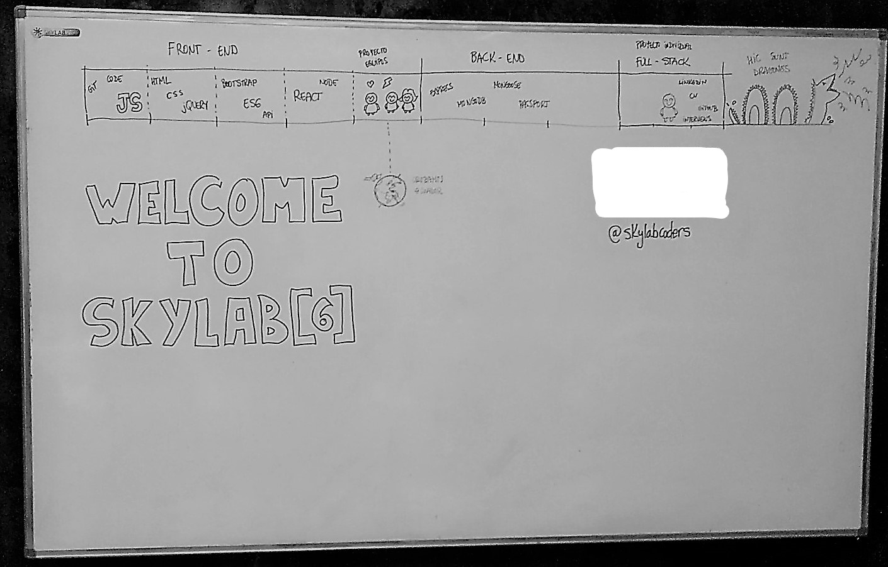

# 
SkyLab Coders - BootCamp
 
## 
Full-Stack Web-Development Bootcamp

#### 
15/01/2018 - 30/03/2018

## FRONT END

## Week 1

- **CLI** =>A command-line interface or command language interpreter* 

- **Agile Web Development =>** broad category of methodologies based on the principles outlined in the Manifesto for Agile Software Development, which was compiled by a team of professional developers in 2001. Specific methods such a scrum and XP are considered agile although they existed before the manifesto was written* 

- **Markdown =>** Markdown’s syntax is intended for one purpose: to be used as a format for writing for the web. [Markdown cheatsheet](https://github.com/Robertvera/skylab-bootcamp-201801/tree/master/course/utils/markdown-cheatsheet.pdf)

- [**Git, GitFlow y Github =>**](https://github.com/Robertvera/skylab-bootcamp-201801/tree/master/course/utils/git.md) *Git is a free and open source distributed version control system*

- [**Jasmine =>**](https://jasmine.github.io/2.9/introduction) *TDD (*Test Driven Development*)*

- **JavaScript =>** is a high-level, dynamic, weakly typed, prototype-based, multi-paradigm, and interpreted programming language.

    - **Objects, variables, arrays, functions**
    - **Hositing =>** *Hoisting is JavaScript's default behavior of moving declarations to the top*
    - **Memoization =>** *is a programming technique which attempts to increase a function's performance by caching its previously computed results*
    - **Polyfills =>** *A polyfill is a browser fallback, made in JavaScript, that allows functionality you expect to work in modern browsers to work in older browsers.*
    - **Prototypes =>** *Every JavaScript object has a prototype. The prototype is also an object. All JavaScript objects inherit their properties and methods from their prototype.* 
    - **this & binding =>**  *Usually we apply bind to fix 'this' in an object method, so that we can pass it somewhere.*
    - **High Order Functions =>** *A higher-order function is a function that can take another function as an argument, or that returns a function as a result*
    

### Challenges Week 1

- [this vs binding](https://github.com/Robertvera/skylab-bootcamp-201801/tree/master/course/topics/frontend/javascript/this-vs-binding)   
- [Shuffle Prototype](https://github.com/Robertvera/skylab-bootcamp-201801/tree/master/course/topics/frontend/javascript/shuffle)
- [Prototypes](https://github.com/Robertvera/skylab-bootcamp-201801/tree/master/course/topics/frontend/javascript/prototypes)
- [Objects](https://github.com/Robertvera/skylab-bootcamp-201801/tree/master/course/topics/frontend/javascript/objects)
- [Control Flow](https://github.com/Robertvera/skylab-bootcamp-201801/tree/master/course/topics/frontend/javascript/control-flow)
- [CamelCase Function](https://github.com/Robertvera/skylab-bootcamp-201801/tree/master/course/topics/frontend/javascript/camel-case)
- [Closures](https://github.com/Robertvera/skylab-bootcamp-201801/tree/master/course/topics/frontend/javascript/closures)
- [Hangman](https://github.com/Robertvera/skylab-bootcamp-201801/tree/master/course/topics/frontend/javascript/hangman)

## Week 2

- **HTML5 =>** Hypertext Markup Language is the standard markup language for creating web pages and web applications. With Cascading Style Sheets and JavaScript it forms a triad of cornerstone technologies for the World Wide Web.*

- **CSS =>** Cascading Style Sheets is a style sheet language used for describing the presentation of a document written in a markup language.
    - **FlexBox**
    - **Grid**

- **Sass =>**(https://sass-guidelin.es/es/) Sass is the most mature, stable, and powerful professional grade CSS extension language in the world.

- **DOM =>**(https://developer.mozilla.org/es/docs/DOM) The Document Object Model is a programming interface for HTML and XML documents. It represents the page so that programs can change the document structure, style, and content. The DOM represents the document as nodes and objects. That way, programming languages can connect to the page. A Web page is a document.

- **JQuery =>** jQuery is a fast, small, and feature-rich JavaScript library. It makes things like HTML document traversal and manipulation, event handling, animation, and Ajax much simpler with an easy-to-use API that works across a multitude of browsers.

- **Ajax (*Asynchronous JavaScript And XML*) =>** a set of Web development techniques using many Web technologies on the client side to create asynchronous Web applications

- [**Node.js =>**](https://nodejs.org/en/) Node.js is a platform built on Chrome's JavaScript runtime for easily building fast and scalable network applications.

### Challenges Week 2

- [Arrays](https://github.com/Robertvera/skylab-bootcamp-201801/tree/master/course/topics/frontend/javascript/arrays)
- [High Order Functions](https://github.com/Robertvera/skylab-bootcamp-201801/tree/master/course/topics/frontend/javascript/higher-order-functions-challenge)
- [Challenges CSS and HTML](https://github.com/Robertvera/skylab-bootcamp-201801/tree/master/course/topics/frontend/javascript/html-css)
- [Challenge Sass](https://github.com/Robertvera/skylab-bootcamp-201801/tree/master/course/topics/frontend/javascript/html-css/sassify-this)
- [Task-List jQuery](https://github.com/Robertvera/skylab-bootcamp-201801/tree/master/course/topics/frontend/jquery/task-list)

## Week 3

- **Frameworks =>** Front-end Frameworks (or CSS Frameworks) usually consist of a package made up of a structure of files and folders of standardized code (HTML, CSS, JS documents etc.) which can be used to support the development of websites, as a basis to start building a site.

    - **Bootstrap =>** Bootstrap is a free and open-source front-end web framework for designing websites and web applications.

    - **Materialize =>** A modern responsive front-end framework based on Material Design

    - **uikit =>** A lightweight and modular front-end framework for developing fast and powerful web interfaces.

- **ECMAScript 6 (ES6)**

    - **ECMAScript 2015 =>** ECMAScript 6 is a significant update to the language, and the first update to the language since ES5 was standardized in 2009. ES6 includes many new features

    - **ES6 Promises =>** The Promise object represents the eventual completion (or failure) of an asynchronous operation, and its resulting value.

    - **Fetch =>** The Fetch API provides a JavaScript interface for accessing and manipulating parts of the HTTP pipeline, such as requests and responses. It also provides a global fetch() method that provides an easy, logical way to fetch resources asynchronously across the network.

- [**API =>**](https://medium.freecodecamp.org/what-is-an-api-in-english-please-b880a3214a82) acronym for Application Programming Interface, which is a software intermediary that allows two applications to talk to each other 
    

### Challenges Week 3

- **Challenges recursion** 
    - [Digit counter](https://github.com/Robertvera/skylab-bootcamp-201801/tree/master/course/topics/frontend/javascript/digit-counter-challenge) 
    - [Wrapper](https://github.com/Robertvera/skylab-bootcamp-201801/tree/master/course/topics/frontend/javascript/stringWrapper)

- [Hangman jQuery](https://github.com/Robertvera/skylab-bootcamp-201801/tree/master/course/topics/frontend/javascript/hangman-css-jquery)
-[API BeerApp](https://github.com/Robertvera/skylab-bootcamp-201801/tree/master/course/topics/frontend/bootstrap/beer-app)
- [API Spotify client - BOOTSTRAP](https://github.com/Robertvera/skylab-bootcamp-201801/tree/master/course/topics/frontend/bootstrap/spoty-api-1.0)
- [API Spotify client - MATERIALIZE](https://github.com/Robertvera/skylab-bootcamp-201801/tree/master/course/topics/frontend/bootstrap/spoty-api-1.2)

## Week 4

### **React**
Biblioteca Javascript de código abierto para crear interfaces de usuario con el objetivo de animar al desarrollo de aplicaciones en una sola página

- [**JSX =>**](https://jsx.github.io/) Is a statically-typed, object-oriented programming language designed to run on modern web browsers

- [**Babel =>**](https://babeljs.io/) Herramienta que nos permite transformar nuestro código JS de última generación (en este caso JSX) a JS que cualquier navegador o versión de Node.js entienda.

- [**React Dev Tools =>**](https://chrome.google.com/webstore/detail/react-developer-tools/fmkadmapgofadopljbjfkapdkoienihi) Tool that allows you to inspect a React tree, including the component hierarchy, props, state, and more

- [**Create-React-App =>**](https://github.com/facebook/create-react-app) Offers a modern build setup with no extra configuration needed.*

- [**React Router =>**](https://github.com/ReactTraining/react-router) React Router keeps your UI in sync with the URL. It has a simple API with powerful features like lazy code loading, dynamic route matching, and location transition handling built right in. Make the URL your first thought, not an after-thought

- [**withRouter =>**](course/Conceptos/react/WithRouter.md) You can get access to the history object's properties.withRouter withRouter will pass updated match, location, and history props to the wrapped component whenever it renders.

### Challenges Week 4 

- [**React simple App Multiply an Divide**](https://github.com/Robertvera/skylab-bootcamp-201801/tree/master/course/topics/frontend/react/calc-react-comp)

- [**ReactApp To Do list**]()
    - [reactapp-todolist](https://github.com/Robertvera/skylab-bootcamp-201801/tree/master/course/topics/frontend/react/react-task-app-comp-2)    
    - [react-task-app-bootstrap](https://github.com/Robertvera/skylab-bootcamp-201801/tree/master/course/topics/frontend/react/task-app-bootstrap)

- [**Spotify with React**](https://github.com/Robertvera/skylab-bootcamp-201801/tree/master/course/topics/frontend/react/spotify-api-promises)

- [**Navbar Bootstrap and react-router**](https://github.com/Robertvera/skylab-bootcamp-201801/tree/master/course/topics/frontend/react/navbar-bootstrap-react-router)

## Week 5

### Front End group project

Time for team project!! a very productive week, we stop and see what we've done for the last 4 weeks and challange our selves by doing a frontend project using **REACT** and **BOOTSTRAP** as main frameworks and many others technologies such as **JASMINE**, **REACT ROUTER** or **MAPBOX GL JS**. We used [SpaceX public API](https://github.com/r-spacex/SpaceX-API).

You can check the full [README](https://github.com/Robertvera/RocketMan/blob/master/README.md) file on the [Rocketman repository](https://github.com/Robertvera/RocketMan/) main folder. You can also check the live demo of the project on this [Surge](http://rocketman-skylab.surge.sh/#/) site.

This project allowed us to secure concepts and go real on pro-like project dynamics. It was a pleasure to work and learn alongside my classmates [Mario](https://github.com/Monty4) and [Carlos](https://github.com/cdemiguel).

You can checkout all classmates projects [here](https://github.com/manuelbarzi/skylab-bootcamp-201801/tree/develop/staff/group-projects).

## BACK END

## Week 6

### **Node.JS**

- [**Node.js =>**](https://nodejs.org/en/) Node.js is a platform built on Chrome's JavaScript runtime for easily building fast and scalable network applications.

- [**Express.js =>**](http://expressjs.com/) Express is a minimal and flexible Node.js web application framework that provides a robust set of features for web and mobile applications.

- **API rest =>** application programming interface (API) is a set of subroutine definitions, protocols, and tools for building application software. In general terms, it is a set of clearly defined methods of communication between various software components.

- [**npm PACKAGES =>**](https://www.npmjs.com/) Use npm to install, share, and distribute code; manage dependencies in your projects; and share & receive feedback with others.

### Challenges Week 6

- [**Learnyounode**](https://github.com/Robertvera/skylab-bootcamp-201801/tree/master/course/topics/backend/node/learnyounode)

- [**Water cleaner**](https://github.com/Robertvera/skylab-bootcamp-201801/tree/master/course/topics/backend/node/water-cleaner)

- [**Chat Node**](https://github.com/Robertvera/skylab-bootcamp-201801/tree/master/course/topics/backend/node/chat-node)

- [**Staff API**](https://github.com/Robertvera/skylab-bootcamp-201801/tree/master/course/topics/backend/staff-api)

- [**User Register**](https://github.com/Robertvera/skylab-bootcamp-201801/tree/master/course/topics/backend/user-register)

- [**Task App**](https://github.com/Robertvera/skylab-bootcamp-201801/tree/master/course/topics/backend/task-app)

## Week 7

- Promise.all vs Promise.race (course/topics/frontend/javascript/promise-all-vs-promise-race)

- npm package: npm winston - logger para escribir logs en un fichero

- [PUG.js](https://pugjs.org)

- Async await (stuff/es6/async-await)

- MongoDB

arrancar MongoDB: en el directorio mongodb-osx-x6.... ejecutar
./bin/mongod --dbpath ./db

arrancar cliente MongoDB: en el directorio mongodb-osx-x6.... ejecutar
./bin/mongo